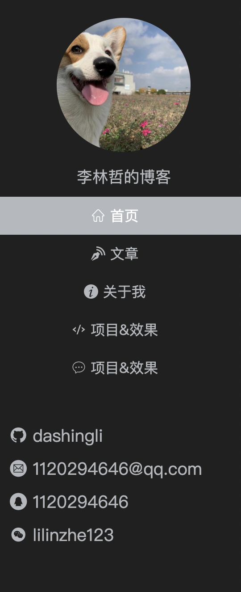

# Avater 组件(头像)

## 预览


## 参数

| 参数  | 类型   | 是否必填 | 是否有默认值 | 参数意义               |
| ----- | ------ | -------- | ------------ | ---------------------- |
| url   | String | 必填     | 无默认值     | 头像地址               |
| width | Number | 非必填   | 150          | 设置头像宽度(宽高相等) |

## 启动测试

```bash
npm run test:Avater
```

# Icon 组件(图标)

## 预览


图标源来自于「阿里巴巴矢量库」

## 参数

| 参数 | 类型   | 是否必填 | 是否有默认值 | 参数意义                   |
| ---- | ------ | -------- | ------------ | -------------------------- |
| name | String | 必填     | 无默认值     | 头像别名(映射变量:nameMap) |

## 启动测试

```bash
npm run test:Icon
```

# Pager 组件(分页)

## 预览


## 参数

| 参数          | 类型   | 是否必填 | 是否有默认值 | 参数意义       |
| ------------- | ------ | -------- | ------------ | -------------- |
| current       | Number | 必填     | 无默认值     | 当前所处页码   |
| total         | Number | 必填     | 无默认值     | 总信息量       |
| pageTotal     | Number | 非必填   | 有默认值:10  | 每页信息量     |
| visibleNumber | Number | 非必填   | 有默认值:5   | 一排可见页码数 |

## 抛出事件

| 事件名        | 含义                                                | 事件参数      | 参数类型 |
| ------------- | --------------------------------------------------- | ------------- | -------- |
| changeCurrent | 用户点击页码(页码非当前页码)时,通知父组件改变其数据 | currentNumber | Number   |
| changeJump    | 用户在页码框输入,点击跳转页码,通知父组件改变其数据  | jumpNumber    | Number   |

```bash
npm run test:Pager
```

# Empty 组件

# Empty


该组件需要在外层容器中横向垂直居中

## 属性

| 属性名 | 含义       | 类型   | 必填 | 默认值   |
| ------ | ---------- | ------ | ---- | -------- |
| text   | 显示的文字 | String | 否   | "无数据" |

```bash
npm run test:Empty
```

# ImageLoader

该组件可以实现一个渐进式图片


## 属性

| 属性名      | 含义                                         | 类型   | 必填 | 默认值 |
| ----------- | -------------------------------------------- | ------ | ---- | ------ |
| src         | 原始图片的路径                               | String | 是   | 无     |
| placeholder | 原始图片加载完成前的占位图片                 | String | 是   | 无     |
| duration    | 原始图片加载完成后，切换到原始图经过的毫秒数 | Number | 否   | 500    |

## 事件

| 事件名      | 含义                   | 事件参数 | 参数类型 |
| ----------- | ---------------------- | -------- | -------- |
| handleImage | 原始图片加载完成后触发 | 无       | 无       |

## 启动测试

```bash
npm run test:ImageLoader
```

# Contact


该组件需要横向撑满容器，背景色透明

## 启动测试

```bash
npm run test:Contact
```

# Menu


该组件需要横向撑满容器，背景色透明

每个菜单的信息如下：

> **首页**
>
> 链接地址：/
>
> 选中条件：路径等于 /
>
> **文章**
>
> 链接地址：/blog
>
> 选中条件：路径以`/blog`开头
>
> **关于我**
>
> 链接地址：/about
>
> 选中条件：路径等于`/about`
>
> **项目&效果**
>
> 链接地址：/project
>
> 选中条件：路径等于`/project`
>
> **留言板**
>
> 链接地址：/message
>
> 选中条件：路径等于`/message`

## 启动测试

```bash
npm run test:Menu
```

# SiteAside



网站侧边栏

宽度和高度撑满外层容器

```bash
npm run test:SiteAside
```

# Layout

使用示例：

```html
<Layout>
  <template #left>
    <div>左边栏区域，宽度适应内容，溢出隐藏</div>
  </template>
  <div>主区域，宽度占满剩余空间，溢出隐藏</div>
  <template #right>
    <div>右边栏区域，宽度适应内容，溢出隐藏</div>
  </template>
</Layout>
```


## 插槽

| 插槽名 | 含义       |
| ------ | ---------- |
| main   | 中间主区域 |
| left   | 左边栏     |
| right  | 右边栏     |

# Message

>  消息弹出小组件

## props

| 属性名     | 类型   | 默认值   | 是否必须 | 含义                                |
| ---------- | ------ | -------- | -------- | ----------------------------------- |
| mesType    | String | success  | /        | 弹窗类型(success  info  warn error) |
| msgContent | String | 消息成功 | /        | 弹窗文字内容                        |
| duration   | Number | /        | 必须     | 弹窗多久消失                        |

父组件使用方法:

```vue
//模版部分
<Message :isShow="isMessage" :duration="duration"></Message>
<button @click="showMsg">发送</button>
data部分
  data(){
      return {
        isMessage : false,
        duration:5000
      }
    }
methods部分
        showMsg(){
            this.isMessage = true
            setTimeout(()=>(this.isMessage = false),this.duration)
        }
//css:Message组件的父容器应设置为相对定位 即可居中
  position: relative;

```

